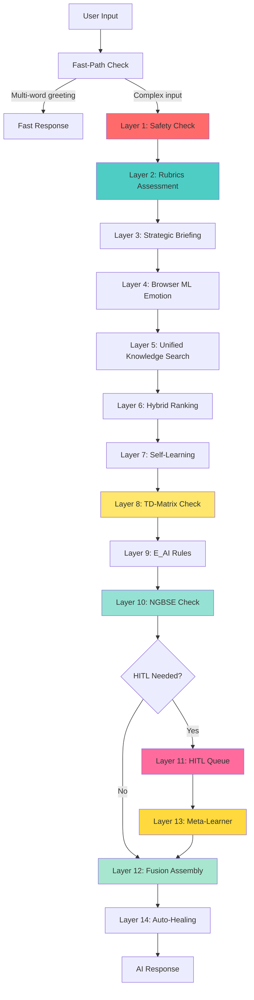
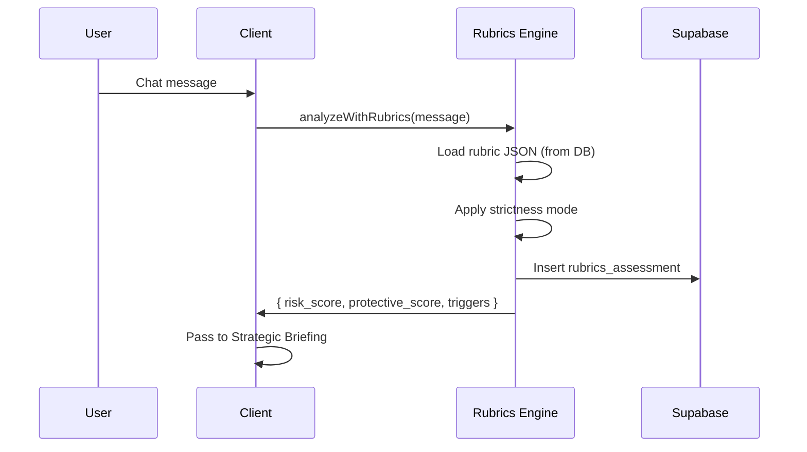
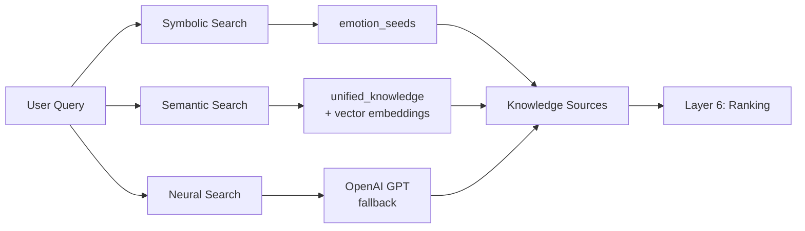
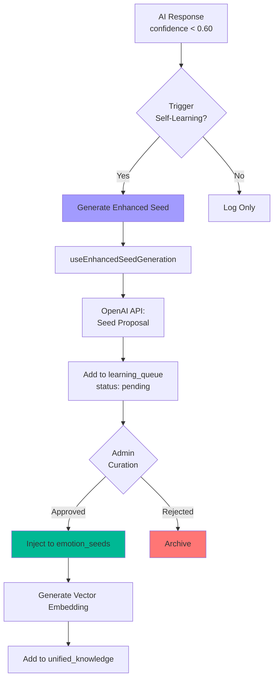
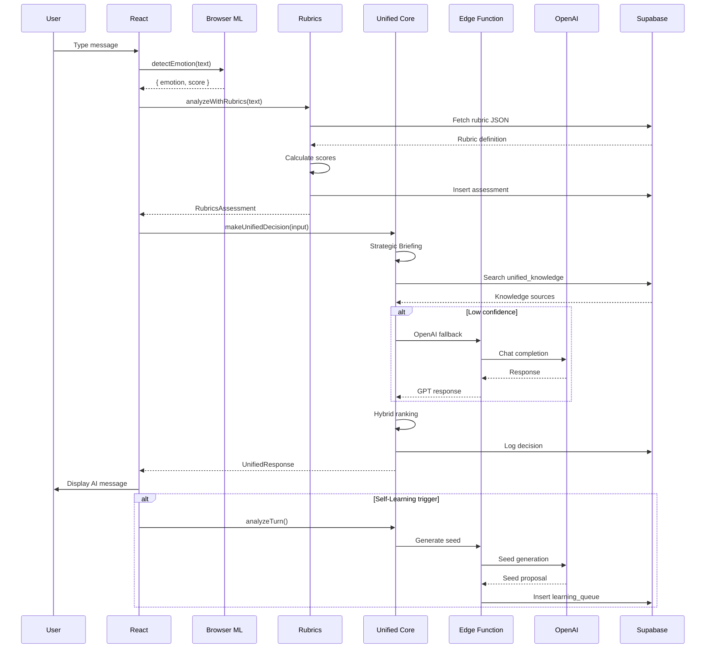

# EvAI Inner Space - Architectuur Documentatie

**Versie**: 5.6  
**Datum**: 26 oktober 2025

## Inhoudsopgave

1. [Overzicht](#overzicht)
2. [Neurosymbolische Pipeline](#neurosymbolische-pipeline)
3. [Data Flow](#data-flow)
4. [Component Architectuur](#component-architectuur)
5. [Database Schema](#database-schema)
6. [Edge Functions](#edge-functions)
7. [Security Layers](#security-layers)

---

## 1. Overzicht

EvAI Inner Space is een therapeutische AI-chatbot gebaseerd op een **14-laags neurosymbolisch systeem (v20)** dat symbolische kennis (emotion seeds) combineert met neural networks (OpenAI GPT, Browser ML) en meta-learning voor adaptieve fusion weights.

### Kernprincipes
- **Privacy by Design**: Browser ML voor lokale emotie-detectie
- **Hybrid Reasoning**: Symbolisch (rule-based) + Neural (AI models) met adaptieve fusion
- **Self-Learning + Meta-Learning**: Automatische kennisgeneratie én weight optimization uit feedback
- **Rubrics-Driven**: EvAI 5.6 therapeutische rubrics voor risicoanalyse
- **Ethical Layer (v20)**: EAA/TD-Matrix/E_AI Rules voor agency-bescherming
- **HITL Integration**: Human-in-the-loop review met Meta-Learner feedback loop

---

## 2. Neurosymbolische Pipeline (v20)

De beslissingspipeline bestaat uit 14 sequentiële layers met Meta-Learner integratie:



## 3. Ethische Laag (v20 EAA Framework)

EVAI v20 heeft een volledig geïntegreerde ethische reflectielaag gebaseerd op het **EAA-framework**:

### EAA Pre-Filter & Integration

```
User Input
    ↓
[EAA Evaluator]         → Ownership, Autonomy, Agency
    ↓
[Regisseur Reflectie]   → Historical self-reflection
    ↓
[Policy + Semantic]     → Existing neurosymbolic layers
    ↓
[TD-Matrix]             → AI dominance monitoring
    ↓
[E_AI Rules Engine]     → Symbolic ethical validation
    ↓
Response (validated)
```

### Kernmodules

| Module | Functie | Locatie |
|--------|---------|---------|
| **EAAEvaluator** | Meet ownership/autonomy/agency | `src/lib/eaaEvaluator.ts` |
| **Regisseur** | Historische reflectie via vectorgeheugen | `src/lib/regisseurReflectie.ts` |
| **TD-Matrix** | Monitort AI vs menselijke agency | `src/lib/tdMatrix.ts` |
| **E_AI Rules** | Symbolische ethische regelset | `src/policy/eai.rules.ts` |

### Ethische Validatie Flow

1. **EAA Evaluatie**: Analyseert input op ownership/autonomy/agency
2. **Regisseur Check**: Raadpleegt historische gedragspatronen
3. **Strategy Validation**: Toetst gekozen strategie aan EAA-profiel
4. **TD Monitoring**: Meet AI-contributie vs user agency (TD > 0.8 = block)
5. **E_AI Rules**: Symbolische ethische regels (6 regels voor agency-bescherming)

**Voorbeeld beslissing**:
```
Input: "Ik weet het echt niet meer, lukt allemaal niet"
EAA: { ownership: 0.6, autonomy: 0.3, agency: 0.2 }
Regisseur: "Lage agency in vergelijkbare gevallen"
TD: 0.45 (balanced)
E_AI: Rule_001 triggered (lage agency + potentiële overbelasting)
→ Beslissing: Alleen reflectie, geen suggesties
```

Zie `docs/eaa-framework.md` voor details.

## 5. Architectuurlagen

### Layer 1: Safety Check
**Doel**: Detectie van harmful content vóór verwerking

```typescript
// Input: User message
// Process: OpenAI Moderation API via evai-core edge function
// Output: { ok: boolean, decision: 'allow' | 'review' | 'block', flags: string[] }

const safety = await checkPromptSafety(userInput);
if (safety.decision === 'block') {
  return errorResponse('harmful_content');
}
```

**Technologie**: OpenAI Moderation API  
**Performance**: ~200ms latency

---

### Layer 2: EvAI 5.6 Rubrics Assessment
**Doel**: Therapeutische risicobeoordeling over 5 dimensies

```typescript
// Rubric Dimensions (EvAI 5.6):
1. Crisis Risk (0-100): Suïcidale gedachten, zelfbeschadiging
2. Emotional Distress (0-100): Intensiteit negatieve emoties
3. Social Support (0-100): Isolatie vs. steun (inverse)
4. Coping Mechanisms (0-100): Adaptieve vs. maladaptieve coping
5. Therapeutic Alliance (0-100): Vertrouwen in behandeling

// Strictness Modes:
- Flexible: Thresholds [30, 50, 70] - Breed therapeutisch bereik
- Moderate: Thresholds [40, 60, 80] - Standaard klinisch
- Strict: Thresholds [50, 70, 90] - Conservatief, hoogdrempelig
```

**Output**: `RubricsAssessment` met risk_score, protective_score, triggers[]

**Flow**:


---

### Layer 3: Strategic Briefing (Regisseur)
**Doel**: Conversational-strategic analyse met rubric context

```typescript
interface StrategicBriefing {
  goal: string;              // "Empathisch reageren op angst, crisis monitoren"
  context: string;           // Samenvatting conversatie + rubric triggers
  keyPoints: string[];       // ["Hoge stress", "Sociale isolatie"]
  priority: 'low' | 'medium' | 'high';
}
```

**Integratievoorbeeld**:
```typescript
const strategicBriefing: StrategicBriefing = {
  goal: "Valideer emotie, bied veilige ruimte",
  context: `Gebruiker toont hoge emotionele distress (rubric score: 78/100).
            Triggers: eenzaamheid, stress, onzekerheid.
            Beschermende factoren: zoekt actief hulp (score: 65/100).`,
  keyPoints: [
    "Crisis risk: laag (25/100)",
    "Emotionele distress: hoog (78/100)",
    "Therapeutische alliantie: matig (60/100)"
  ],
  priority: 'high'
};
```

**Gebruikt door**: `useUnifiedDecisionCore` (Layer 5)

---

### Layer 4: Browser ML Emotion Detection
**Doel**: Client-side emotie pre-detectie zonder API calls

```typescript
// Model: Xenova/bert-base-multilingual-uncased-sentiment
// Output: { label: 'positive' | 'negative' | 'neutral', score: 0.0-1.0 }

const browserEmotion = await detectEmotion(userInput);
// Gebruikt in Layer 6 voor ranking boost
```

**Voordeel**: Privacy (lokaal) + snelheid (geen API latency)

---

### Layer 5: Unified Knowledge Search
**Doel**: Zoeken in 3 parallelle kennis-bronnen



**1. Symbolic Search**:
```sql
-- Keyword matching in emotion_seeds
SELECT * FROM emotion_seeds
WHERE emotion ILIKE '%angst%'
  AND triggers @> ARRAY['onzekerheid']
  AND active = true
ORDER BY weight DESC, (meta->>'usageCount')::int DESC;
```

**2. Semantic Search**:
```sql
-- Vector similarity in unified_knowledge
SELECT * FROM search_unified_knowledge(
  query_text := 'ik voel me angstig',
  query_embedding := <vector>,
  similarity_threshold := 0.7
);
-- Returns top 10 semantically similar responses
```

**3. Neural Search (Fallback)**:
```typescript
// Als Symbolic + Semantic < 3 results:
const gptResponse = await openai.chat.completions.create({
  model: 'gpt-4o-mini',
  messages: [
    { role: 'system', content: therapeuticPrompt },
    { role: 'user', content: userInput }
  ]
});
```

---

### Layer 6: Hybrid Ranking System
**Doel**: Combineer scores uit alle bronnen voor optimale match

```typescript
interface ScoredSource {
  content: string;
  emotion: string;
  confidence: number;
  sources: {
    symbolic: number;    // 0-1 (keyword match strength)
    semantic: number;    // 0-1 (vector similarity)
    browserML: number;   // 0-1 (emotion alignment)
    rubrics: number;     // 0-1 (therapeutic relevance)
  };
  finalScore: number;    // Weighted average
}

// Ranking weights (versie 5.6):
const weights = {
  symbolic: 0.30,
  semantic: 0.35,
  browserML: 0.15,
  rubrics: 0.20
};
```

**Voorbeeld**:
```typescript
// Source A: "Het is oké om je angstig te voelen"
{
  symbolic: 0.85,   // Keyword "angstig" gevonden
  semantic: 0.78,   // Vector similarity hoog
  browserML: 0.62,  // Emotion match: negative
  rubrics: 0.90,    // Therapeutisch relevant (distress hoog)
  finalScore: 0.80  // Weighted: 0.30*0.85 + 0.35*0.78 + 0.15*0.62 + 0.20*0.90
}
```

**Output**: Top 3 hoogst scorende responses

---

### Layer 7: Self-Learning Manager
**Doel**: Automatische kennisgeneratie uit low-confidence interacties



**Triggers**:
- Confidence < 0.60
- Nieuwe emotie gedetecteerd (niet in bestaande seeds)
- Gebruikersfeedback: dislike op response

**Process**:
```typescript
// 1. Detecteer low confidence
if (result.confidence < 0.60) {
  const outcome = await analyzeTurn(userInput, result, history);
  
  // 2. Genereer enhanced seed
  if (outcome.triggered) {
    const seed = await generateEnhancedSeed({
      emotion: detectedEmotion,
      userInput,
      conversationHistory: history
    });
    
    // 3. Voeg toe aan learning_queue
    await supabase.from('learning_queue').insert({
      seed_id: seed.id,
      confidence: result.confidence,
      curation_status: 'pending'
    });
  }
}
```

**Admin Workflow**:
```typescript
// Admin Dashboard: Learning Queue tab
const pendingSeeds = await supabase
  .from('learning_queue')
  .select('*, emotion_seeds(*)')
  .eq('curation_status', 'pending')
  .order('created_at', { ascending: false });

// Approve → Activeer seed + genereer embedding
// Reject → Archiveer met reden
```

---

### Layer 8: TD-Matrix Check (v20)
**Doel**: Monitoring van AI-dominantie vs menselijke agency

```typescript
// Locatie: src/lib/tdMatrix.ts
interface TDResult {
  score: number;           // 0-1 (0 = user dominant, 1 = AI dominant)
  shouldBlock: boolean;    // true als TD > 0.8
  reasoning: string;
}

const tdScore = evaluateTD(aiContribution, userAgency);
if (tdScore.shouldBlock) {
  // Fallback naar safety response of template
}
```

**Blocking Rules**:
- TD > 0.8 → Block (te veel AI-dominantie)
- TD > 0.7 + agency < 0.3 → Block (kwetsbare gebruiker)
- Crisis mode → TD forced to < 0.2 (minimal AI)

---

### Layer 9: E_AI Rules Engine (v20)
**Doel**: Symbolische ethische regelvalidatie

```typescript
// Locatie: src/policy/eai.rules.ts
const eaiRules = [
  'rule_001: Agency Loss Detection',
  'rule_002: Bias Detection',
  'rule_003: Metacognitive Reflection Required',
  'rule_004: Agency Enhancement',
  'rule_005: Compliance Check',
  'rule_006: Structural Agency Loss Block'
];

const result = evaluateEAIRules(context);
if (result.triggered && result.severity === 'high') {
  // Block response, gebruik fallback
}
```

---

### Layer 10: NGBSE Check (Neural-Guided Bias & Safety Engine)
**Doel**: Detectie van assumptions, bias, context gaps

```typescript
// Locatie: src/lib/ngbseEngine.ts
const ngbseResult = await detectBlindspots({
  userInput,
  aiResponse,
  conversationHistory,
  eaaProfile
});

// Modules:
// - assumptionDetector: Ongefundeerde aannames
// - biasChecker: Culturele/persoonlijke bias
// - contextGapDetector: Ontbrekende essentiële context
// - confidenceCalibrator: Overconfidence correctie
```

**Triggers HITL bij**:
- Critical assumptions detected
- High bias score (>0.7)
- Context gap + high stakes
- Overconfidence (claimed >0.9, actual <0.6)

---

### Layer 11: HITL Queue (Human-In-The-Loop)
**Doel**: Admin review voor edge cases

```typescript
// Locatie: src/lib/hitlTriggers.ts
const hitlDecision = await shouldTriggerHITL({
  crisisScore: 85,
  tdScore: 0.82,
  blindspots: ngbseResult,
  confidence: 0.42,
  failureCount: 3
});

if (hitlDecision.shouldTrigger) {
  await triggerHITL(userInput, aiResponse, hitlDecision);
}
```

**Review Flow**:
1. Admin ziet item in HITL Queue (Admin Dashboard)
2. Keuzes: Approve / Reject / Override
3. Meta-Learner leert uit decision:
   - Approved → Neural weight +3.5%
   - Rejected → Symbolic weight +3.5%
   - Override → Trigger learning event

---

### Layer 12: Fusion Assembly (NeSy v20)
**Doel**: Intelligent combineren van symbolic + neural responses

```typescript
// Locatie: src/orchestrator/fusionHelpers.ts
interface FusionContext {
  symbolic: { content: string, confidence: number };
  neural: { content: string, reasoning: string };
  validation: { validated: boolean, tdScore: number };
  userContext: { eaaProfile, conversationHistory };
}

// Get learned weights from cache (30s TTL)
const weights = await FusionWeightCache.getInstance()
  .getWeights(contextType);

// Apply fusion strategy
const fused = applyFusionWeights(
  symbolic.content,
  neural.content,
  weights.symbolicWeight,
  weights.neuralWeight
);
```

**Context-Aware Weight Profiles**:
- `crisis`: 90% symbolic (safety first)
- `low_confidence`: 75% symbolic
- `user_agency_high`: 60% symbolic
- `greeting`: 20% symbolic (conversational)
- `normal`: 65% symbolic (learned baseline)

---

### Layer 13: Meta-Learner (Adaptive Fusion Weights)
**Doel**: Optimalisatie van fusion weights via feedback learning

```typescript
// Locatie: src/lib/fusionWeightCalibrator.ts
class FusionWeightCalibrator {
  async learnFromHITL(decision: 'approved' | 'rejected' | 'override') {
    // Calculate weight shift
    const rawShift = decision === 'approved' ? 0.05 : -0.05;
    const dampenedShift = rawShift * this.dampeningFactor; // 0.7
    
    // Update candidate weights (not production yet)
    await this.updateCandidateWeights(contextType, dampenedShift);
    
    // Check if ready for promotion (≥10 samples)
    if (sampleCount >= 10) {
      await this.promoteToProduction(contextType);
      await this.invalidateCache(contextType);
    }
  }
}
```

**Learning Sources**:
1. **HITL Feedback**: Admin decisions → +/-3.5% per decision
2. **Self-Learning**: New seed success → +1-5% neural weight
3. **Performance Metrics**: Success rate tracking

**Safety Constraints**:
- Max shift: 5% per update
- Dampening: 0.7 (prevents oscillation)
- Min samples: 10 before production
- Crisis override: Always ≥85% symbolic

---

### Layer 14: Auto-Healing
**Doel**: Automatische recovery van mislukte responses

```typescript
// Locatie: src/orchestrator/autoHealing.ts
const healingResult = await attemptHealing({
  failureType: 'td_violation',
  originalResponse,
  context
});

// Healing strategies:
// 1. Template fallback (pre-approved responses)
// 2. Crisis protocol (bij crisis >80)
// 3. Simplified response (reduce AI contribution)
// 4. Escalation (naar HITL queue)
```

**Triggers**:
- TD violations (score >0.8)
- E_AI rule blocks
- Low confidence + high stakes
- Repeated failures (3+ in session)

---

## 3. Data Flow

### End-to-End Request Flow



**Latency Breakdown** (typisch):
- Browser ML: 50-150ms
- Rubrics: 100-300ms (incl. DB)
- Unified Search: 200-500ms
- OpenAI fallback: 1000-2000ms (als nodig)
- **Totaal**: 350-1000ms (zonder fallback), 1350-3000ms (met fallback)

---

## 4. Component Architectuur

### Frontend Structure

```
src/
├── components/
│   ├── ChatView.tsx              # Main chat interface
│   ├── ChatBubble.tsx            # Message display
│   ├── InputBar.tsx              # User input
│   ├── ConsentBanner.tsx         # Privacy consent
│   ├── TopBar.tsx                # Navigation
│   ├── admin/
│   │   ├── AdminDashboard.tsx    # Admin overview
│   │   ├── AdvancedSeedManager.tsx
│   │   ├── RubricSettings.tsx    # EvAI 5.6 config
│   │   └── ...
│   └── rubrics/
│       ├── RubricsToggleControl.tsx
│       └── SystemInteractionMatrix.tsx
├── hooks/
│   ├── useChat.ts                # Main chat logic
│   ├── useUnifiedDecisionCore.ts # Layer 5 logic
│   ├── useBrowserTransformerEngine.ts # Layer 4
│   ├── useEvAI56Rubrics.ts       # Layer 2
│   ├── useSelfLearningManager.ts # Layer 7
│   ├── useEnhancedSeedGeneration.ts
│   └── ...
├── lib/
│   ├── safetyGuard.ts            # Layer 1
│   ├── embeddingUtils.ts         # Vector operations
│   └── advancedSeedStorage.ts
├── pages/
│   ├── Index.tsx                 # Chat page
│   ├── AdminDashboard.tsx
│   └── AdminGuide.tsx
└── integrations/
    └── supabase/
        ├── client.ts
        └── types.ts
```

### Key Hooks

**useChat.ts**: Orchestrator
```typescript
export function useChat() {
  const { makeUnifiedDecision } = useUnifiedDecisionCore();
  const { analyzeWithRubrics } = useEvAI56Rubrics();
  const { detectEmotion } = useBrowserTransformerEngine();
  const { analyzeTurn } = useSelfLearningManager();
  
  const handleSendMessage = async (input: string) => {
    // 1. Safety check
    const safety = await checkPromptSafety(input);
    if (!safety.ok) return handleUnsafe(safety);
    
    // 2. Rubrics
    const rubrics = await analyzeWithRubrics(input);
    
    // 3. Browser ML
    const browserEmotion = await detectEmotion(input);
    
    // 4-6. Unified decision
    const result = await makeUnifiedDecision(input, {
      rubrics,
      browserEmotion,
      history: messages
    });
    
    // 7. Self-learning
    if (result.confidence < 0.60) {
      await analyzeTurn(input, result, messages);
    }
    
    return result;
  };
}
```

---

## 5. Database Schema

### Core Tables

```sql
-- Emotion Seeds (Symbolische kennis)
CREATE TABLE emotion_seeds (
  id UUID PRIMARY KEY,
  user_id UUID,
  emotion TEXT NOT NULL,
  label TEXT,
  response JSONB,              -- { nl, en, fr }
  meta JSONB,                  -- { triggers, confidence, usageCount }
  weight DOUBLE PRECISION,     -- Dynamic (feedback-driven)
  active BOOLEAN DEFAULT true,
  expires_at TIMESTAMP,
  created_at TIMESTAMP,
  updated_at TIMESTAMP
);

-- Unified Knowledge (Hybrid)
CREATE TABLE unified_knowledge (
  id UUID PRIMARY KEY,
  user_id UUID,
  content_type TEXT,           -- 'seed' | 'embedding' | 'gpt'
  emotion TEXT,
  triggers TEXT[],
  response_text TEXT,
  confidence_score DOUBLE PRECISION,
  vector_embedding vector(1536), -- pgvector
  usage_count INT DEFAULT 0,
  active BOOLEAN DEFAULT true,
  created_at TIMESTAMP,
  updated_at TIMESTAMP
);

-- Learning Queue (Self-learning)
CREATE TABLE learning_queue (
  id UUID PRIMARY KEY,
  user_id UUID,
  prompt_id UUID REFERENCES chat_messages(id),
  seed_id UUID REFERENCES emotion_seeds(id),
  feedback_text TEXT,
  confidence DOUBLE PRECISION,
  curation_status TEXT CHECK (curation_status IN ('pending', 'approved', 'rejected')),
  metadata JSONB,
  created_at TIMESTAMP,
  updated_at TIMESTAMP
);

-- Rubrics Assessments
CREATE TABLE rubrics_assessments (
  id UUID PRIMARY KEY,
  user_id UUID,
  conversation_id TEXT,
  message_content TEXT,
  rubric_id TEXT,              -- 'evai56'
  risk_score DOUBLE PRECISION,
  protective_score DOUBLE PRECISION,
  overall_score DOUBLE PRECISION,
  triggers JSONB,              -- [{ dimension, score, threshold_exceeded }]
  confidence_level TEXT,       -- 'low' | 'medium' | 'high'
  processing_mode TEXT,        -- 'flexible' | 'moderate' | 'strict'
  created_at TIMESTAMP,
  updated_at TIMESTAMP
);

-- Decision Logs (Observability)
CREATE TABLE decision_logs (
  id UUID PRIMARY KEY,
  user_id UUID,
  conversation_id TEXT,
  user_input TEXT,
  final_response TEXT,
  confidence_score DOUBLE PRECISION,
  processing_time_ms INT,
  symbolic_matches JSONB,
  neural_similarities JSONB,
  hybrid_decision JSONB,
  api_collaboration JSONB,     -- { api1Used, api2Used, ... }
  rubrics_analysis JSONB,
  workflow_version TEXT,       -- '5.6'
  created_at TIMESTAMP
);
```

### Indexes & Performance

```sql
-- Vector similarity search (HNSW)
CREATE INDEX idx_unified_knowledge_embedding
ON unified_knowledge
USING hnsw (vector_embedding vector_cosine_ops);

-- Full-text search
CREATE INDEX idx_unified_knowledge_search
ON unified_knowledge
USING gin(search_vector);

-- Learning queue filtering
CREATE INDEX idx_learning_queue_status
ON learning_queue(curation_status);

-- Rubrics time-series queries
CREATE INDEX idx_rubrics_created
ON rubrics_assessments(created_at DESC);
```

---

## 6. Edge Functions

### evai-core (Primary)

**File**: `supabase/functions/evai-core/index.ts`

**Operations**:
1. **chat**: OpenAI chat completions (fallback Layer 5)
2. **embedding**: Text embeddings (Layer 5 semantic search)
3. **safety**: Content moderation (Layer 1)

```typescript
// Example: Safety check
POST /functions/v1/evai-core
{
  "operation": "safety",
  "text": "User input here"
}

// Response:
{
  "ok": true,
  "decision": "allow",
  "score": 0.95,
  "flags": []
}
```

**Rate Limiting**: 60 req/min per user (future enhancement)

---

### evai-admin (Admin)

**File**: `supabase/functions/evai-admin/index.ts`

**Operations**:
- Seed curation (approve/reject learning_queue)
- Bulk operations (activate/deactivate seeds)
- System health checks

---

## 7. Security Layers

### 7.1 Row-Level Security (RLS)

Alle tabellen hebben RLS enabled:

```sql
-- Example: emotion_seeds
CREATE POLICY "Single user access"
ON emotion_seeds
FOR ALL
USING (user_id = '00000000-0000-0000-0000-000000000001'::uuid);

-- Future: Multi-user support
CREATE POLICY "Users access own data"
ON emotion_seeds
FOR ALL
USING (user_id = auth.uid());
```

### 7.2 API Key Management

```typescript
// NEVER in client code:
// const apiKey = "sk-...";

// ✅ Always via Edge Functions:
const { data } = await supabase.functions.invoke('evai-core', {
  body: { operation: 'chat', prompt: '...' }
});
```

**Environment Variables** (Supabase Secrets):
- `OPENAI_API_KEY`: Primary GPT access
- `OPENAI_API_KEY_SECONDARY`: Secondary analysis
- `VECTOR_API_KEY`: Embeddings
- `OPENAI_API_KEY_SAFETY`: Moderation

### 7.3 Input Validation

```typescript
// In Edge Functions:
if (!text || text.length > 5000) {
  throw new Error('Invalid input length');
}

// Sanitization:
const sanitized = text.trim().replace(/[<>]/g, '');
```

---

## 8. Performance Optimizations

### 8.1 Client-Side Caching
```typescript
// React Query (5min cache):
const { data: seeds } = useQuery({
  queryKey: ['emotion-seeds'],
  queryFn: fetchSeeds,
  staleTime: 5 * 60 * 1000
});
```

### 8.2 Database Optimizations
- **Materialized views**: Voor analytics queries
- **Partial indexes**: Op active=true kolommen
- **Connection pooling**: Supabase Pooler (6053 port)

### 8.3 Edge Function Best Practices
- **Warm starts**: Keep functions warm met periodic pings
- **Parallel requests**: Batch multiple operations
- **Streaming**: Voor lange OpenAI responses (future)

---

## 9. Observability

### Monitoring Stack
- **Supabase Dashboard**: Real-time logs, metrics
- **decision_logs**: Alle AI beslissingen gelogd
- **api_collaboration_logs**: API usage tracking
- **reflection_logs**: Self-learning events

### Key Metrics
```sql
-- Average confidence per day
SELECT
  DATE(created_at) as date,
  AVG(confidence_score) as avg_confidence,
  COUNT(*) as decisions
FROM decision_logs
WHERE created_at > NOW() - INTERVAL '30 days'
GROUP BY DATE(created_at)
ORDER BY date DESC;

-- Rubrics risk trends
SELECT
  DATE(created_at) as date,
  AVG(risk_score) as avg_risk,
  AVG(protective_score) as avg_protective
FROM rubrics_assessments
WHERE created_at > NOW() - INTERVAL '7 days'
GROUP BY DATE(created_at);
```

---

## 10. Deployment

### Stack
- **Frontend**: Lovable.dev (React + Vite)
- **Database**: Supabase PostgreSQL 15 + pgvector
- **Edge Functions**: Deno runtime (Supabase)
- **Models**: OpenAI GPT-4o-mini, Transformers.js (browser)

### CI/CD
- Auto-deploy on push to main
- Edge functions deployed via Supabase CLI
- Database migrations tracked in `supabase/migrations/`

---

**Next Steps**: Zie [roadmap.md](./roadmap.md) voor geplande features.

**Questions?** Open een issue of contact: privacy@evai-innerspace.nl
