# MasterFlow Architecture - Complete Flow

## 🎯 Overview
Dit diagram toont de volledige v20 MasterFlow met Meta-Learner integratie.

## 🔄 Complete Processing Flow

```mermaid
graph TD
    A[User Input] --> B[Safety Check]
    B --> C[Rubrics Assessment]
    C --> D[EAA Evaluation]
    
    D --> E{EAA Profile Valid?}
    E -->|Low Agency/Autonomy| F[Reflective Response Only]
    E -->|Valid| G[Regisseur Briefing]
    
    G --> H[Policy Decision Engine]
    
    H --> I{Decision Type?}
    I -->|CRISIS| J[Crisis Protocol]
    I -->|TEMPLATE| K[Template Response]
    I -->|USE_SEED| L[Semantic Graph]
    I -->|LLM_PLANNING| M[LLM Planning]
    
    L --> N[Vector Search]
    N --> O{Confidence?}
    O -->|High ≥88%| P[Seed-Based Response]
    O -->|Low <88%| Q[Learning Mode]
    
    M --> R[Neural LLM Generation]
    R --> S[TD-Matrix Check]
    
    S --> T{TD Score OK?}
    T -->|TD <0.6| U[Block/Adjust]
    T -->|TD ≥0.6| V[E_AI Rules]
    
    V --> W{Rules Pass?}
    W -->|Violation| X[Safety Fallback]
    W -->|Pass| Y[NGBSE Check]
    
    Y --> Z{Assumptions/Bias?}
    Z -->|Detected| AA[HITL Queue]
    Z -->|Clean| AB[Fusion Assembly]
    
    P --> AB
    Q --> AC[Generate New Seed]
    AC --> AD[Validate New Seed]
    AD --> AE{Seed Valid?}
    AE -->|Yes| AF[Store + Use]
    AE -->|No| X
    
    AF --> AB
    J --> AB
    K --> AB
    
    AB --> AG[Fusion Assembly: Get Learned Weights]
    AG --> AH[Apply Context-Aware Fusion]
    AH --> AI[Calculate Preservation Score]
    AI --> AJ[Final Validation Layer]
    
    AJ --> AK{Valid?}
    AK -->|Yes| AL[Final Response]
    AK -->|No| X
    
    AL --> AM[User Receives Response]
    
    AA --> AN[Admin Reviews]
    AN --> AO{Admin Decision}
    AO -->|Approved| AP[Meta-Learner: ↑Neural Weight]
    AO -->|Rejected| AQ[Meta-Learner: ↑Symbolic Weight]
    AO -->|Override| AR[Meta-Learner: Trigger Learning]
    
    AP --> AS[Update Candidate Weights]
    AQ --> AS
    AR --> AS
    
    AS --> AT{Samples ≥10?}
    AT -->|Yes| AU[Promote to Production]
    AT -->|No| AV[Keep as Candidate]
    
    AU --> AW[Invalidate Cache]
    AW --> AX[Next Request Uses New Weights]
    
    Q --> AY[Self-Learning Event]
    AY --> AZ[Meta-Learner: Reflection Learning]
    AZ --> AS
    
    style B fill:#ff6b6b
    style D fill:#4ecdc4
    style H fill:#ffe66d
    style L fill:#95e1d3
    style AB fill:#a8e6cf
    style AG fill:#ffd93d,stroke:#ff9500,stroke-width:3px
    style AP fill:#6bcf7f
    style AQ fill:#ff6b9d
    style AR fill:#c44569
    
    classDef fusionNode fill:#ffd93d,stroke:#ff9500,stroke-width:3px
    classDef metaLearnerNode fill:#6bcf7f,stroke:#00b894,stroke-width:3px
    
    class AG,AH fusionNode
    class AP,AQ,AR,AS metaLearnerNode
```



## 🧠 Meta-Learner Integration Points

### 1. HITL Feedback Loop

```mermaid
graph LR
    A[HITL Queue Item] --> B[Admin Reviews]
    B --> C{Decision}
    C -->|Approved| D[Neural was correct]
    C -->|Rejected| E[Symbolic was correct]
    C -->|Override| F[Both failed]
    
    D --> G[Meta-Learner]
    E --> G
    F --> G
    
    G --> H[Calculate Dampened Shift]
    H --> I[Store Candidate Weight]
    I --> J{Samples ≥10?}
    J -->|Yes| K[Promote to Production]
    J -->|No| L[Keep Learning]
    
    K --> M[Cache Invalidation]
    M --> N[Next Fusion Uses New Weights]
```


### 2. Self-Learning Integration


## 🔒 Safety Guarantees

### Weight Adjustment Constraints
- **Max shift per update**: 5% (0.05)
- **Dampening factor**: 70% (0.7)
- **Min samples for promotion**: 10
- **Cache TTL**: 30 seconds
- **Crisis override**: Symbolic weight forced ≥85%

### Context-Based Weights
```
crisis: 
  symbolic: 0.90
  neural: 0.10

low_confidence:
  symbolic: 0.75
  neural: 0.25

user_agency_high:
  symbolic: 0.60
  neural: 0.40

normal:
  symbolic: 0.65
  neural: 0.35
```

## 📊 Performance Characteristics

### Non-Blocking Design
1. **Fusion Assembly reads from cache**: <10ms overhead
2. **Weight updates are async**: 0ms blocking
3. **HITL learning is fire-and-forget**: 0ms blocking
4. **Self-learning is async**: 0ms blocking

### Gradual Learning
- Weights change max **5% per update**
- **Dampening factor** prevents oscillation
- **Candidate system** requires 10+ samples before production
- **Cache invalidation** ensures updates propagate within 30s

## 🧪 Testing Scenarios

### Scenario 1: High Confidence Path
```
Input → Rubrics → EAA → Policy → Seed Match (92%) 
→ Fusion (learned weights) → Response
Time: ~150ms
```

### Scenario 2: Learning Mode
```
Input → Rubrics → EAA → Policy → Seed Match (65%) 
→ Learning Mode → Generate Seed → Validate 
→ Meta-Learner (async) → Response
Time: ~2500ms (learning async, doesn't block response)
```

### Scenario 3: HITL Feedback
```
NGBSE detects bias → HITL Queue 
→ Admin rejects → Meta-Learner (async) 
→ Symbolic weight +3.5% → Candidate stored 
→ After 10 samples → Promoted to production
Time: Minutes to hours (background process)
```

## 🎯 Decision Matrix

| Condition | Decision Type | Fusion Weights | Meta-Learner Impact |
|-----------|---------------|----------------|---------------------|
| Crisis >80 | CRISIS | Symbolic 90% | None (safety override) |
| Seed ≥88% | USE_SEED | Learned weights | Applied from cache |
| Seed <88% | LLM_PLANNING | Learned weights | Applied from cache |
| HITL approved | - | - | Neural +3.5% (async) |
| HITL rejected | - | - | Symbolic +3.5% (async) |
| Self-learning success | - | - | Neural +1-5% (async) |

## 📝 Key Innovations

1. **Cache-First Architecture**: Zero database queries in critical path
2. **Eventual Consistency**: Async learning doesn't block responses
3. **Candidate/Production System**: Prevents premature weight changes
4. **Dampening Factor**: Prevents runaway oscillation
5. **Context-Aware Weights**: Different weights per situation
6. **Safety Overrides**: Crisis always uses safe weights
7. **Gradual Learning**: Max 5% shift per update
8. **Multi-Source Learning**: HITL + Self-Learning both contribute

## 🔮 Future Enhancements

- [ ] A/B testing framework for weight strategies
- [ ] Per-user weight personalization
- [ ] Confidence-based weight interpolation
- [ ] Automatic rollback on performance degradation
- [ ] Meta-Learner dashboard with real-time weight evolution
- [ ] Predictive weight optimization using historical patterns
