# Meta-Learner Detailed Flow

## 🧠 Meta-Learner Core Architecture

```mermaid
graph TD
    A[Learning Trigger] --> B{Trigger Type?}
    
    B -->|HITL Feedback| C[HITL Learning Path]
    B -->|Self-Learning| D[Reflection Learning Path]
    
    C --> E[Get HITL Item Context]
    E --> F{Admin Decision?}
    F -->|Approved| G[Direction: Neural]
    F -->|Rejected| H[Direction: Symbolic]
    F -->|Override| I[Trigger Learning Mode]
    
    D --> J[Get Reflection Context]
    J --> K{New Seeds Generated?}
    K -->|Yes| L[Direction: Neural]
    K -->|No| M[Direction: Symbolic]
    
    G --> N[Get Current Production Weights]
    H --> N
    L --> N
    M --> N
    
    N --> O[Calculate Dampened Shift]
    O --> P[Apply Max Shift Limit]
    P --> Q[Apply Dampening Factor]
    
    Q --> R[Create Candidate Weight]
    R --> S[Store in Database]
    
    S --> T{Candidate Samples ≥10?}
    T -->|No| U[Keep as Candidate]
    T -->|Yes| V[Promote to Production]
    
    V --> W[Update Production Record]
    W --> X[Invalidate Cache]
    X --> Y[Next Request Uses New Weight]
    
    U --> Z[Wait for More Samples]
    
    style C fill:#4ecdc4
    style D fill:#95e1d3
    style O fill:#ffd93d
    style V fill:#6bcf7f
    style X fill:#ff6b9d
```



## 🔄 Weight Calculation Algorithm

```mermaid
graph LR
    A[Current Weight] --> B[Calculate Raw Shift]
    B --> C{Direction}
    C -->|Neural| D[Shift = +MAX_SHIFT × Impact]
    C -->|Symbolic| E[Shift = +MAX_SHIFT × Impact]
    
    D --> F[Apply Dampening]
    E --> F
    
    F --> G[Dampened Shift = Shift × 0.7]
    G --> H[New Weight = Current + Dampened Shift]
    
    H --> I{Exceeds 0.9?}
    I -->|Yes| J[Cap at 0.9]
    I -->|No| K[Use New Weight]
    
    J --> L[Complement = 1.0 - Weight]
    K --> L
    
    L --> M[Final Weight Pair]
```



## 📊 Weight Evolution Example


## 🎯 Context Type Mapping

```mermaid
graph TD
    A[Processing Context] --> B{Validation Status}
    
    B -->|Not Validated| C[Context: crisis]
    B -->|Validated| D{Confidence Level}
    
    D -->|<0.6| E[Context: low_confidence]
    D -->|≥0.6| F{TD Score}
    
    F -->|<0.4| G[Context: user_agency_high]
    F -->|≥0.4| H[Context: normal]
    
    C --> I[Use Crisis Weights]
    E --> J[Use Low Confidence Weights]
    G --> K[Use High Agency Weights]
    H --> L[Use Normal Weights]
    
    I --> M[Symbolic 90%, Neural 10%]
    J --> N[Symbolic 75%, Neural 25%]
    K --> O[Symbolic 60%, Neural 40%]
    L --> P[Symbolic 65%, Neural 35%]
    
    style C fill:#ff6b6b
    style E fill:#ffd93d
    style G fill:#4ecdc4
    style H fill:#95e1d3
```



## 🔒 Safety Mechanisms

### 1. Max Shift Constraint

```mermaid
graph LR
    A[Proposed Shift] --> B{Shift >5%?}
    B -->|Yes| C[Cap at 5%]
    B -->|No| D[Use Proposed Shift]
    C --> E[Apply Dampening 70%]
    D --> E
    E --> F[Final Shift ≤3.5%]
```


### 2. Dampening Factor


### 3. Candidate System

```mermaid
graph TD
    A[New Weight Calculated] --> B[Store as Candidate]
    B --> C[Collect Samples]
    C --> D{Samples ≥10?}
    D -->|No| E[Keep Testing]
    D -->|Yes| F[Validate Performance]
    F --> G{Performance OK?}
    G -->|Yes| H[Promote to Production]
    G -->|No| I[Discard Candidate]
    E --> C
```


### 4. Crisis Override

```mermaid
graph LR
    A[Learned Weight Retrieved] --> B{Crisis Detected?}
    B -->|Yes| C[Force Symbolic ≥85%]
    B -->|No| D[Use Learned Weight]
    C --> E[Safety First]
    D --> F[Performance Optimized]
```


## 📈 Performance Monitoring

### Weight Stability Metrics


### Cache Performance


## 🔄 Feedback Loop Timing


## 🧪 Example Scenarios

### Scenario A: Rapid Approval (Neural Boost)
```
Initial State:
  Context: normal
  Symbolic: 65%, Neural: 35%

Events:
  t=0: HITL approved → Neural direction
  t=1: Raw shift +5%, dampened +3.5%
  t=2: Candidate: S 65%, N 38.5%
  t=10: 10 samples collected
  t=11: Promoted → S 61.5%, N 38.5%

Result: Neural weight increased by 3.5%
```

### Scenario B: Rejection Pattern (Symbolic Boost)
```
Initial State:
  Context: low_confidence
  Symbolic: 75%, Neural: 25%

Events:
  t=0: HITL rejected → Symbolic direction
  t=1: Raw shift +5%, dampened +3.5%
  t=2: Candidate: S 78.5%, N 21.5%
  t=3-9: More rejections
  t=10: Promoted → S 78.5%, N 21.5%
  t=20: Another rejection
  t=21: Candidate: S 82%, N 18%

Result: Symbolic weight increased by 7% total
```

### Scenario C: Self-Learning Success
```
Initial State:
  Context: normal
  Symbolic: 65%, Neural: 35%

Events:
  t=0: Low confidence response (72%)
  t=1: Self-learning triggered
  t=2: New seed generated (confidence 85%)
  t=3: Learning impact: 0.15
  t=4: Raw shift +7.5%, dampened +5.25%
  t=5: Candidate: S 65%, N 40.25%
  t=15: Promoted → S 59.75%, N 40.25%

Result: Neural weight increased by 5.25%
```

## 🎯 Convergence Properties


