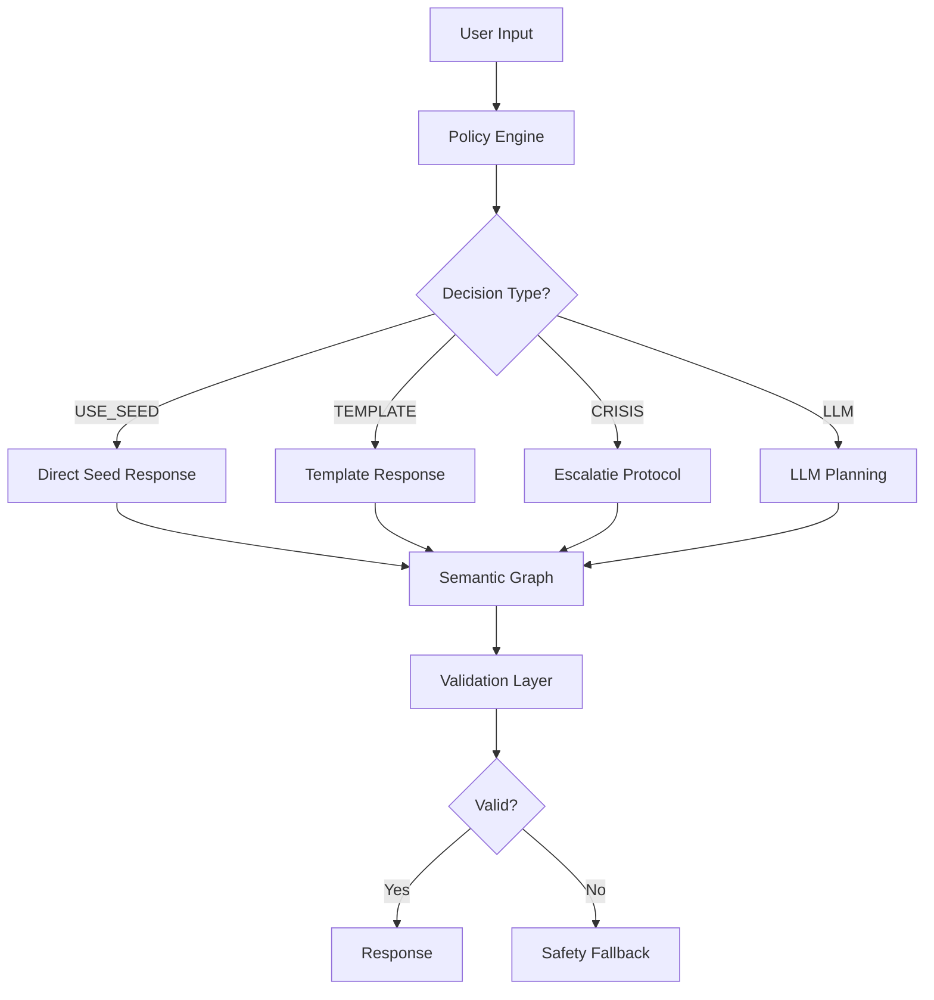

# EvAI v16 - Neurosymbolische Architectuur

## 🎯 Overzicht

EvAI v16 implementeert een **sterk neurosymbolische architectuur** met:
- ✅ Policy Engine (pre-LLM beslissingen)
- ✅ Validation Layer (post-LLM constraints)
- ✅ Semantic Graph (emotion-intervention ontologie)
- ✅ Hybrid Orchestrator (auditeerbare beslissingen)

## 📂 Architectuur

```
src/
├── policy/
│   ├── decision.policy.ts      # Pre-LLM regel-engine
│   └── validation.policy.ts    # Post-LLM validation
├── semantics/
│   └── graph.ts                # Emotion-intervention ontologie
└── orchestrator/
    └── hybrid.ts               # Hybrid orchestrator met audit trail
```

## 🔄 Decision Flow



## 🎯 Policy Rules (Prioriteit)

1. **Crisis Escalatie** (P:100) - Bij crisis >80 + consent
2. **Fast Path** (P:90) - Simple greetings, lage distress
3. **High Seed Match** (P:80) - Seed match ≥88%
4. **Template** (P:70) - Lage distress <35
5. **LLM Planning** (P:50) - Complexe gevallen

## 💡 Semantic Graph

**Emoties → Interventies mapping:**
- Verdriet → Valideren (0.95), Empathie (0.90)
- Angst → Grounding (0.90), Psycho-educatie (0.85)
- Boosheid → Valideren (0.90), Normaliseren (0.80)

**Contra-indicaties:**
- Crisis >80: Geen self-help
- Coping <20: Geen reflectievragen
- Distress >70: Geen suggesties

## 🛡️ Validation Constraints

**Plan Validatie:**
- Structuur check (goal/strategy/steps)
- Crisis-level checks
- PII filtering
- Contra-indicatie verificatie

**Response Validatie:**
- Lengte checks (20-500 chars)
- Verboden content (diagnoses, medicatie)
- Crisis-escalatie taal vereist bij crisis >80

## 📊 Metrics & Monitoring

**Audit Log bevat:**
- Policy beslissing + regel ID
- Semantic interventies
- Validation resultaten
- Processing path
- Timestamps

**Stats:**
- Policy hit-rate (% beslissingen door rules)
- Validation pass-rate
- Constraint violations prevented

## 🧪 Testing

```typescript
// Test policy rules
import { testRule } from '@/policy/decision.policy';
testRule('high_seed_match', context);

// Test validation
import { testValidation } from '@/policy/validation.policy';
testValidation(plan, response, context);

// Test semantic graph
import { testSemanticGraph } from '@/semantics/graph';
testSemanticGraph();
```

## 🚀 Next Steps

- [ ] Z3 constraint solver integratie (formele verificatie)
- [ ] Ablation test suite
- [ ] Red-team security tests
- [ ] RDF/OWL upgrade voor semantic graph
- [ ] Policy versioning systeem
